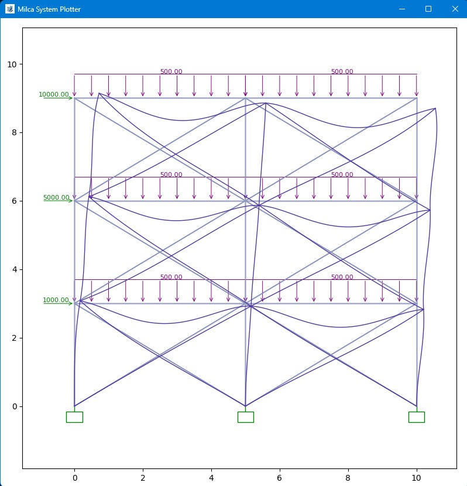

# ***DOCUMENTACION DE ANALISIS MATRICIAL***

matriz de regidez local para elementos de tipo marco, con consideraciones de defkeciones de corte.

$$
\begin{bmatrix}
\frac{E A}{L} & 0 & 0 & -\frac{E A}{L} & 0 & 0 \\
0 & \frac{12 E I}{L^3 (1 + \phi)} & \frac{6 E I}{L^2 (1 + \phi)} & 0 & -\frac{12 E I}{L^3 (1 + \phi)} & \frac{6 E I}{L^2 (1 + \phi)} \\
0 & \frac{6 E I}{L^2 (1 + \phi)} & \frac{(4 + \phi) E I}{L (1 + \phi)} & 0 & -\frac{6 E I}{L^2 (1 + \phi)} & \frac{(2 - \phi) E I}{L (1 + \phi)} \\
-\frac{E A}{L} & 0 & 0 & \frac{E A}{L} & 0 & 0 \\
0 & -\frac{12 E I}{L^3 (1 + \phi)} & -\frac{6 E I}{L^2 (1 + \phi)} & 0 & \frac{12 E I}{L^3 (1 + \phi)} & -\frac{6 E I}{L^2 (1 + \phi)} \\
0 & \frac{6 E I}{L^2 (1 + \phi)} & \frac{(2 - \phi) E I}{L (1 + \phi)} & 0 & -\frac{6 E I}{L^2 (1 + \phi)} & \frac{(4 + \phi) E I}{L (1 + \phi)}
\end{bmatrix}
$$

---
matriz de transformacion de coordenadas (rotacion) dezplamientos en "x", "y" y rotacion en "z".

$$
T =
\begin{bmatrix}
\cos\theta & \sin\theta & 0 & 0 & 0 & 0 \\
-\sin\theta & \cos\theta & 0 & 0 & 0 & 0 \\
0 & 0 & 1 & 0 & 0 & 0 \\
0 & 0 & 0 & \cos\theta & \sin\theta & 0 \\
0 & 0 & 0 & -\sin\theta & \cos\theta & 0 \\
0 & 0 & 0 & 0 & 0 & 1
\end{bmatrix}
$$

---
vector de fuerzas debido a una carga trapezoidal.

$$
F =
\begin{bmatrix}
0 \\
\frac{7}{20} q_i L + \frac{3}{20} q_j L \\
\frac{1}{20} q_i L^2 + \frac{1}{30} q_j L^2 \\
0 \\
\frac{3}{20} q_i L + \frac{7}{20} q_j L \\
-\left(\frac{1}{30} q_i L^2 + \frac{1}{20} q_j L^2\right)
\end{bmatrix}
$$

La libreria tiene la capacidad simular analsis estructural estatico.    
El xf 

Este es un párrafo.  
Este es otro en la misma línea.

Este está separado por una línea en blanco.

#123  → Referencia a un issue o PR
@milca  → Mención a un usuario

Este texto es rojo

<!DOCTYPE html>
<html lang="es">
<head>
    <meta charset="UTF-8">
    <meta name="viewport" content="width=device-width, initial-scale=1.0">
    <title>Mi Primera Página</title>
</head>
<body>
    <h1>¡Hola, mundo!</h1>
    
Este es un párrafo de ejemplo.

</body>
</html>

<h1>Título Principal</h1>
<h2>Subtítulo</h2>
<h3>Encabezado nivel 3</h3>
<h4>Encabezado nivel 4</h4>
<h5>Encabezado nivel 5</h5>
<h6>Encabezado nivel 6</h6>

Este es un párrafo.

  <!-- Salto de línea -->

Otro párrafo.

<b>Texto en negrita</b>
<strong>Texto importante</strong>
<i>Texto en cursiva</i>
<em>Texto enfatizado</em>
<u>Texto subrayado</u>

<ul>
    <li>Elemento 1</li>
    <li>Elemento 2</li>
    <li>Elemento 3</li>
</ul>

<ol>
    <li>Primer elemento</li>
    <li>Segundo elemento</li>
    <li>Tercer elemento</li>
</ol>

<dl>
    <dt>Término</dt>
    <dd>Definición del término</dd>
</dl>

<a href="https://www.google.com" target="_blank">Ir a Google</a>

<form action="procesar.php" method="POST">
    <label for="nombre">Nombre:</label>
    <input type="text" id="nombre" name="nombre">
    
    <label for="email">Correo:</label>
    <input type="email" id="email" name="email">
    
    <button type="submit">Enviar</button>
</form>

<input type="password" name="clave">
<input type="number" name="edad">
<input type="date" name="fecha">
<input type="checkbox" name="acepto">
<input type="radio" name="opcion" value="1">
<select name="pais">
    <option value="mx">México</option>
    <option value="es">España</option>
</select>

<table border="1">
    <tr>
        <th>Nombre</th>
        <th>Edad</th>
    </tr>
    <tr>
        <td>Juan</td>
        <td>25</td>
    </tr>
    <tr>
        <td>Ana</td>
        <td>30</td>
    </tr>
</table>

<video controls width="500">
    <source src="https://www.youtube.com/watch?v=xeWTSUCSyOw" type="video/mp4">
    Tu navegador no soporta videos.
</video>

<audio controls>
    <source src="audio.mp3" type="audio/mpeg">
    Tu navegador no soporta audio.
</audio>

# Mi Video de YouTube

<header>Encabezado principal</header>
<nav>Menú de navegación</nav>
<section>Sección de contenido</section>
<article>Artículo independiente</article>
<aside>Contenido lateral</aside>
<footer>Pie de página</footer>

