# **MILCApy**

es un modulo de MilcaStrures, sirve para anlizar estructuras 2D con elementos tipo frame

## Incluye
- diagrama de fuerzas axiales
- diagrama de fuerzas cortantes
- diagrama de momentos flectores
- diagrama de pendietes o giros
- digrama de deflexiones
- deforma general
- cargas distribuidas en elementos
- cargas puntuales en los nodos
- aplicacion de cargas tipo CSI SAP2000
- patrones o casos de carga
- sistema de visualizacion interactiva

## Ejemplos
```python
from milcapy import SystemMilcaModel
from milcapy.plotter.UIdisplay import main_window
# UNIDADES: (kN, m)

portico = SystemMilcaModel()
portico.add_material("concreto", 2.2e7, 0.3)
portico.add_rectangular_section("sec1", "concreto", 0.5, 0.5)
portico.add_rectangular_section("sec2", "concreto", 0.3, 0.65)

nodes = {
    1: (0, 0),
    2: (0, 4),
    3: (4, 6),
    4: (8, 4),
    5: (8, 0)
}

for node, coord in nodes.items():
    portico.add_node(node, *coord)

elements = {
    1: (1, 2, "sec1"),
    2: (2, 3, "sec2"),
    3: (4, 3, "sec2"),
    4: (5, 4, "sec1")
}

for element, (node1, node2, section) in elements.items():
    portico.add_member(element, node1, node2, section)

portico.add_restraint(1, (True, True, True))
portico.add_restraint(5, (True, True, True))

portico.add_load_pattern("CARGA1")
portico.add_point_load(3, "CARGA1", 100000)
portico.add_distributed_load(1, "CARGA1", -5, -5)
portico.add_distributed_load(2, "CARGA1", -5, -5)
# portico.add_distributed_load(3, "CARGA1", 7, 7, "GLOBAL", direction="GRAVITY")

portico.add_load_pattern("CARGA2")
portico.add_distributed_load(2, "CARGA2", -7, -7)
portico.add_distributed_load(3, "CARGA2", 7, 7)

portico.add_load_pattern("CARGA3")
portico.add_distributed_load(3, "CARGA3", 5, 5)
portico.add_distributed_load(4, "CARGA3", 5, 5)

# --------------------------------------------------
# 5. Resolución del modelo
# --------------------------------------------------
portico.postprocessing_options.n = 40
portico.analysis_options.include_shear_deformations = False
portico.solve()

# --------------------------------------------------
# 6. Resultados
# --------------------------------------------------
portico._inicialize_plotter()
portico.plotter.initialize_plot()
main_window(portico)
```

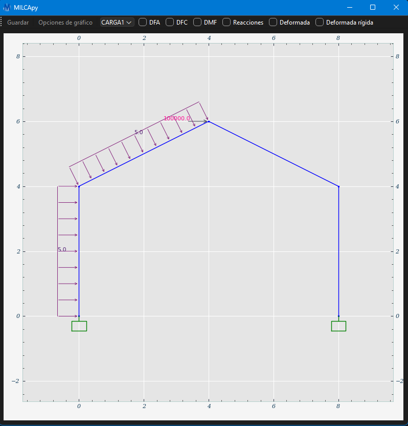
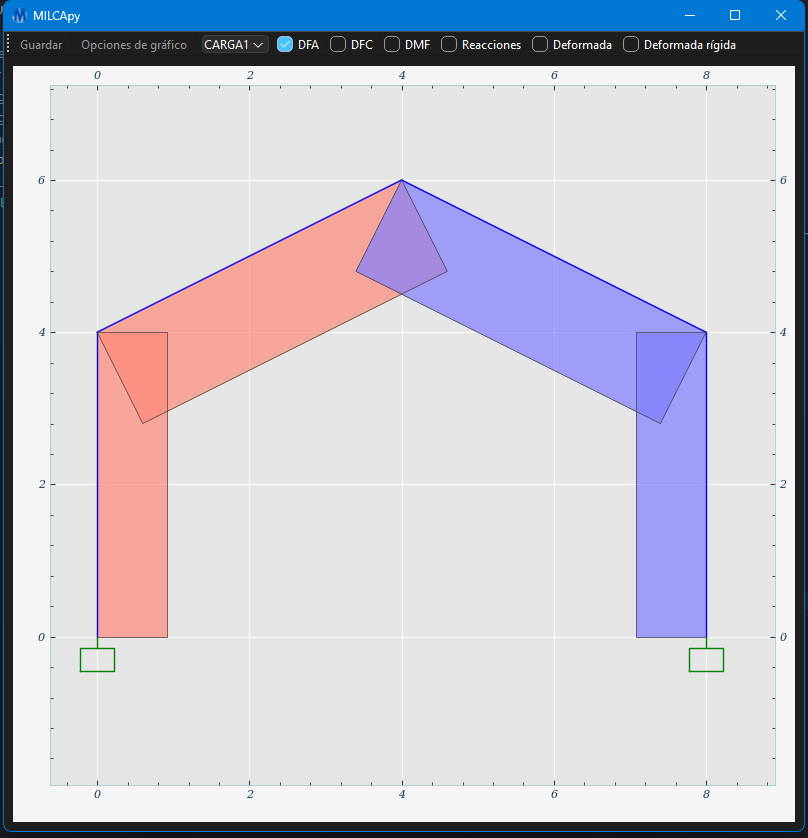
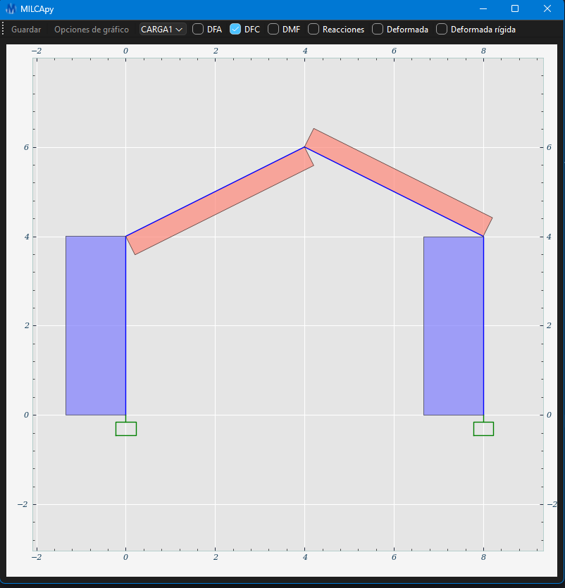
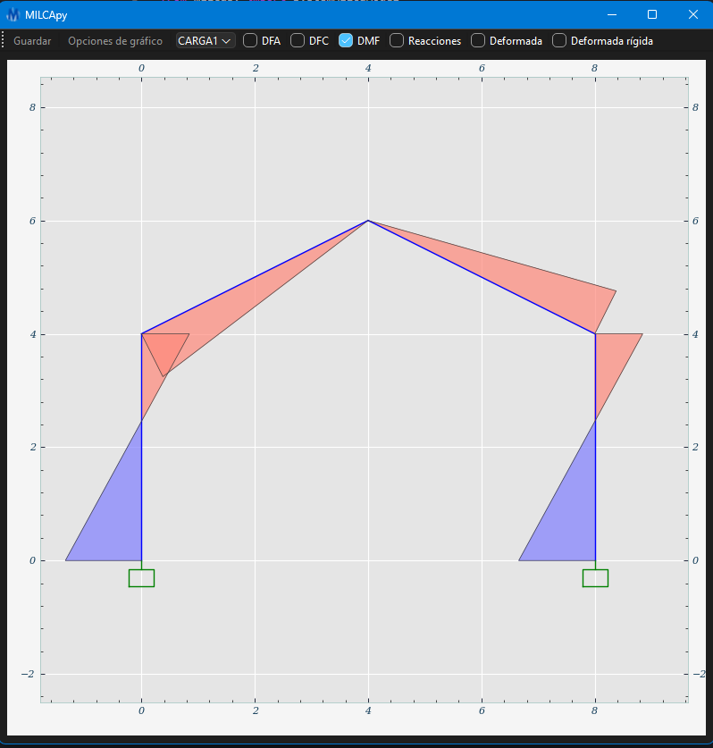
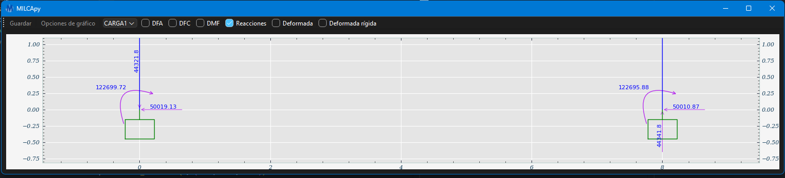
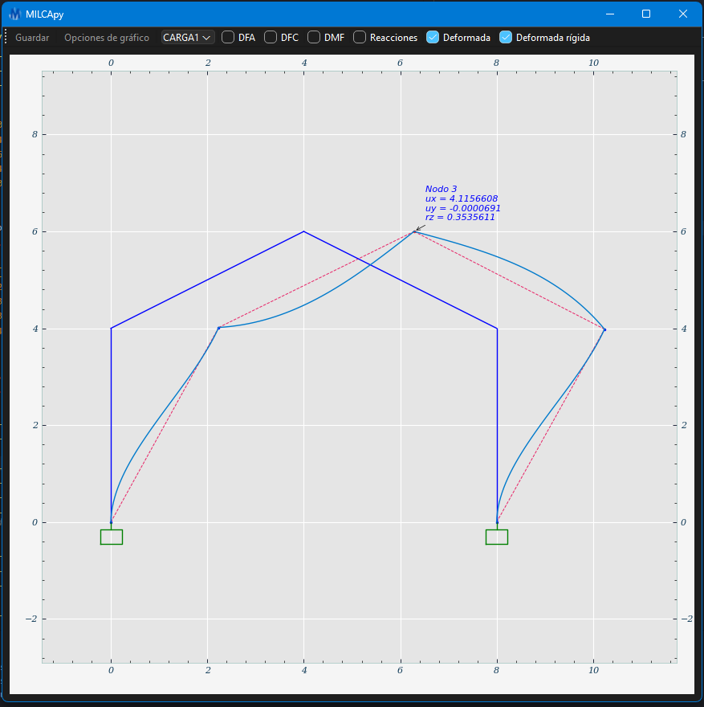


```python

from milcapy import SystemMilcaModel
from milcapy.plotter.UIdisplay import main_window
# --------------------------------------------------
# 1. Definición del modelo y secciones
# --------------------------------------------------

model = SystemMilcaModel()

model.add_material(
    name="concreto",
    modulus_elasticity=2.1e6,
    poisson_ratio=0.2
)

model.add_rectangular_section(
    name="seccion1",
    material_name="concreto",
    base=0.3,
    height=0.5
)
model.add_rectangular_section(
    name="seccion2",
    material_name="concreto",
    base=0.5,
    height=0.5
)
model.add_rectangular_section(
    name="seccion3",
    material_name="concreto",
    base=0.6,
    height=0.6
)

# --------------------------------------------------
# 2. Definición de nodos
# --------------------------------------------------
nodes = {
    1: (0, 0),
    2: (0, 5),
    3: (0, 8.5),
    4: (0, 12),
    5: (7, 0),
    6: (7, 5),
    7: (7, 8.5),
    8: (7, 12),
}

for key, value in nodes.items():
    model.add_node(key, *value)

# --------------------------------------------------
# 3. Definición de elementos
# --------------------------------------------------
elements = {
    1: (1, 2, "seccion3"),
    2: (2, 3, "seccion3"),
    3: (3, 4, "seccion3"),
    4: (5, 6, "seccion2"),
    5: (6, 7, "seccion2"),
    6: (7, 8, "seccion2"),
    7: (2, 6, "seccion1"),
    8: (3, 7, "seccion1"),
    9: (4, 8, "seccion1"),
}

for key, value in elements.items():
    model.add_member(key, *value)

# --------------------------------------------------
# 4. Restricciones y cargas
# --------------------------------------------------
model.add_restraint(1, (True, True, True))
model.add_restraint(5, (True, True, True))

model.add_load_pattern(name="Live Load")
model.add_point_load(2, "Live Load", 5, 0, 0, "GLOBAL")
model.add_point_load(3, "Live Load", 10, 0, 0, "GLOBAL")
model.add_point_load(4, "Live Load", 20, 0, 0, "GLOBAL")

model.add_distributed_load(7, "Live Load", -5, -5, "LOCAL")
model.add_distributed_load(8, "Live Load", -2, -6, "LOCAL")
model.add_distributed_load(9, "Live Load", -4, -3, "LOCAL")

# --------------------------------------------------
# 5. Resolución del modelo
# --------------------------------------------------
model.solve()


# --------------------------------------------------
# 6. Mostrar la ventana con la figura
# --------------------------------------------------
model._inicialize_plotter()
model.plotter.initialize_plot()
main_window(model)
```

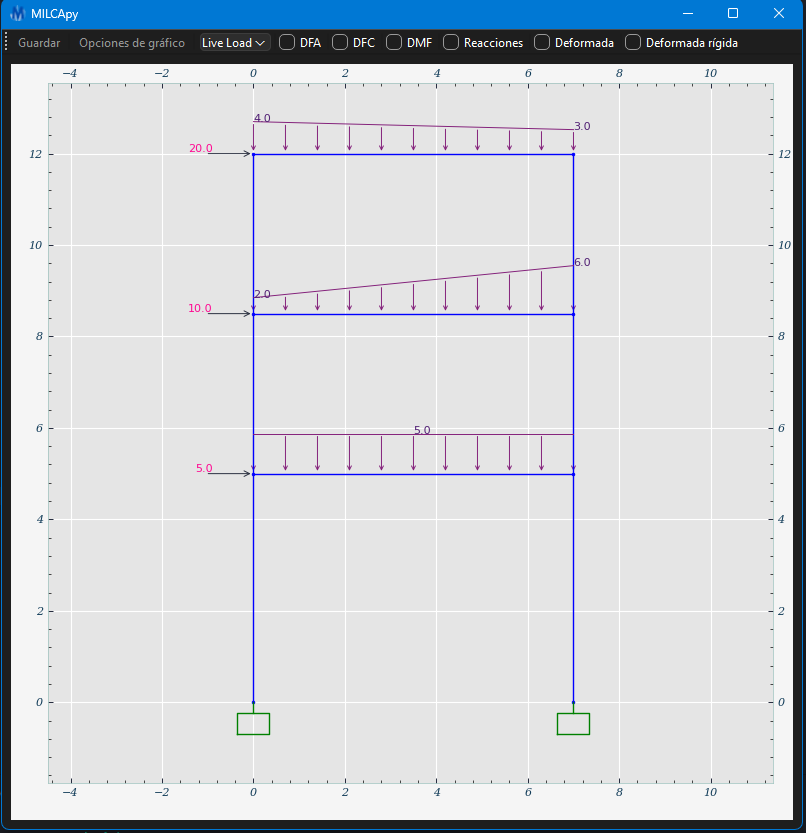
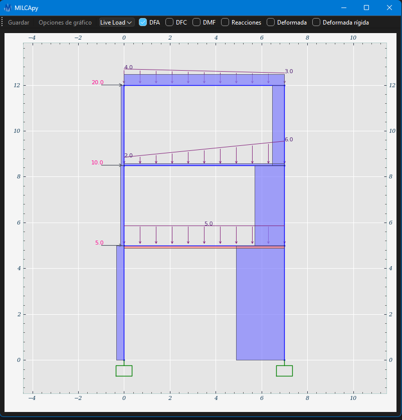
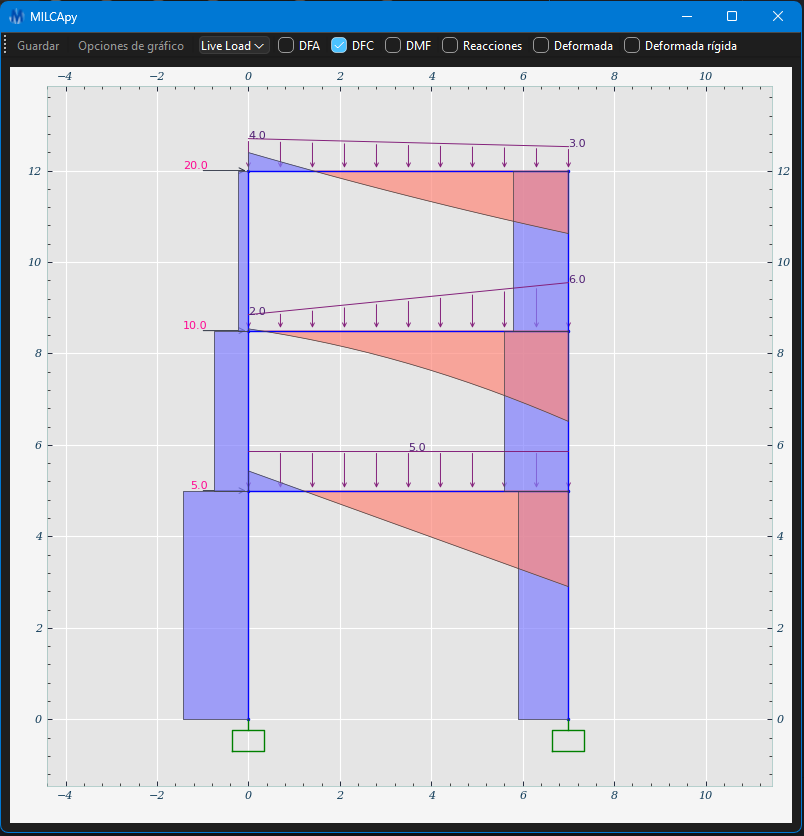
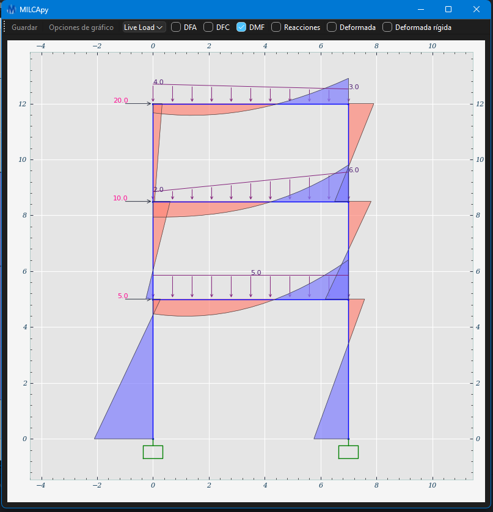
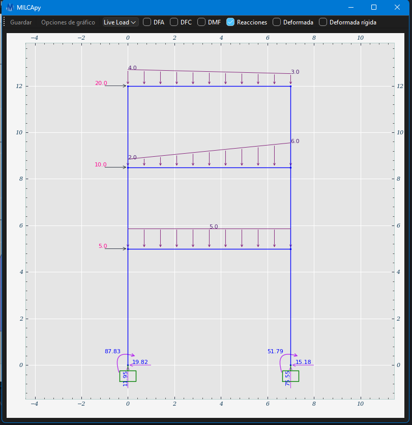
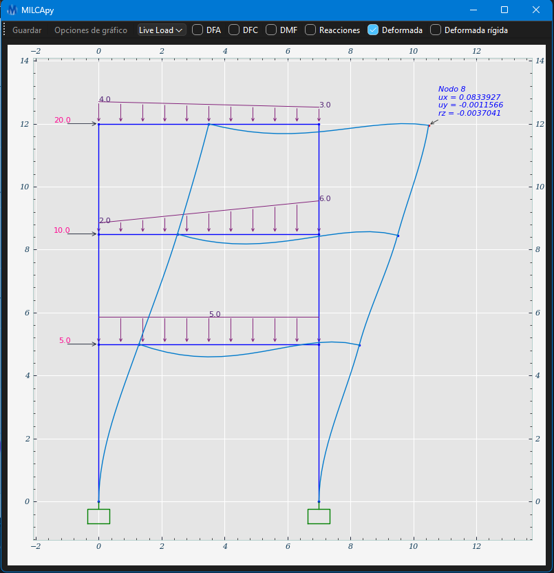